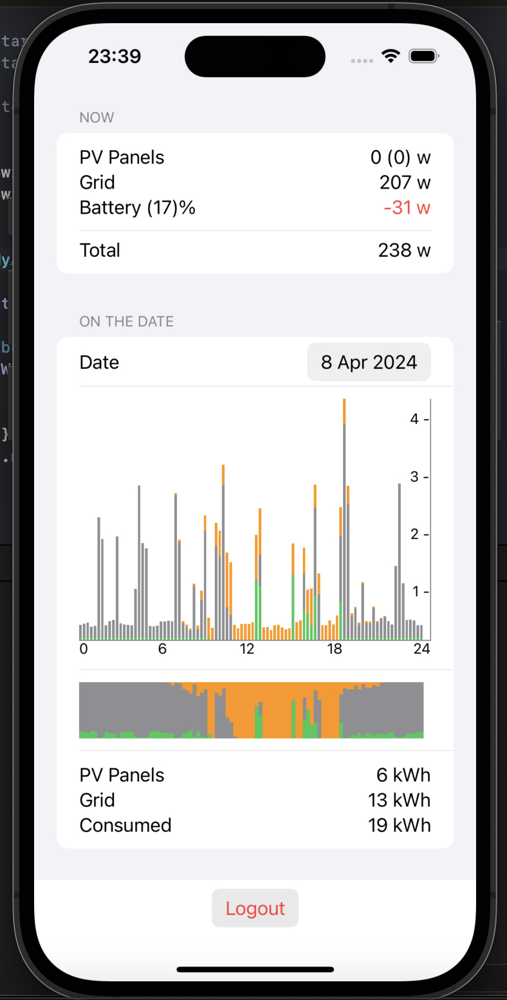

# MyAutarco-alt
Alternative app to the official MyAutarco 

# How to use

Simply log in with your existing my.autarco.com user.

App directly communicating to Autarco's services and does not use any other external systems.

Credentials securely stored on your device in the Keychain.

# Support 

To get help, file an issue or request a feature, please file an issue [here](https://github.com/sakrist/MyAutarco-alt/issues).

If you want to connect directly, reach out on one of my social media platforms; the list of my accounts can be found [here](https://github.com/sakrist).
